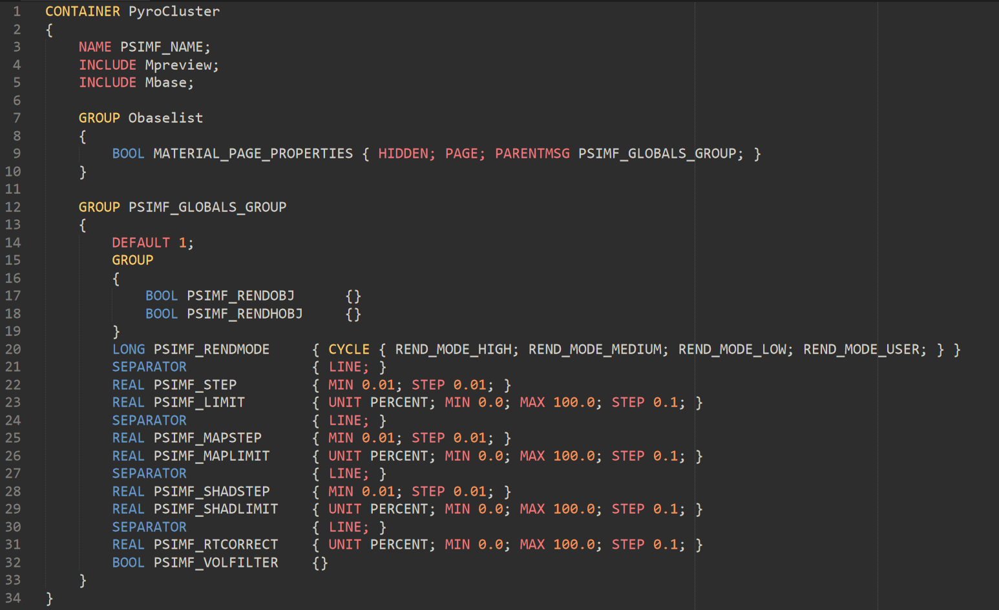
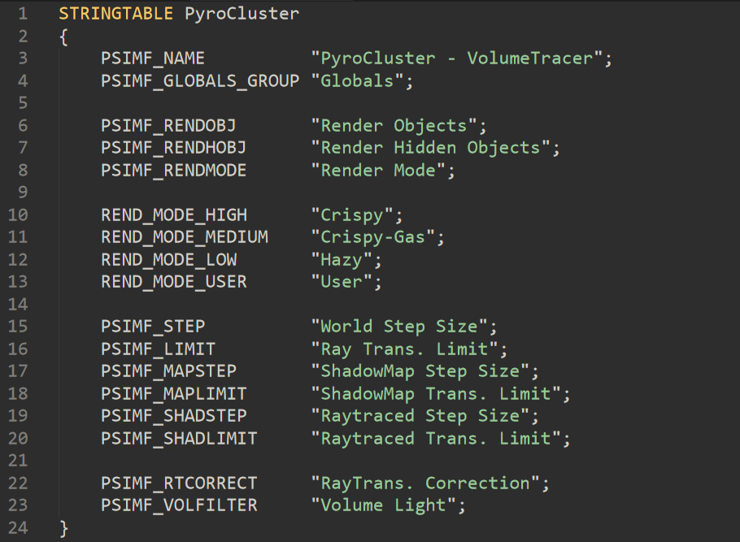

# SublimeCinemaDescription
SublimeText syntax definition for Cinema 4D description resources. 

This definition has been designed for description resources and captures its *.res and *.str files. It can also be used for dialog resources, but won't capture all features of it. There will also be some missing flags and types for resource files, due to the format being rather extensive. This mostly serves as case of "good enough" ;).

The definition captures:
* .res & *.str files
* container like directives, e.g., `CONTAINER` or `STRINGTABLE`
* parameters, e.g., `BOOL` or `VECTOR`
* flags, e.g., `NAME` or `MIN`
* numbers, strings and c-style single line comments

The syntax capturing will look like this (color scheme not included):

